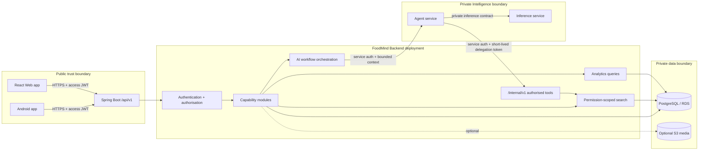

# FoodMind Backend Architecture, Database Design, and Development Plan

**Status:** Proposed

**Owner:** Chen Yaqi

**Last updated:** 28 July 2026

**Target repository:** `foodmind-backend`

**Public contract affected:** `/api/v1` OpenAPI

**Private contracts affected:** Backend-to-Agent requests/results and Agent-to-Backend authorised tools

**Delivery constraint:** Four one-week sprints

## 1. Executive decision

Build FoodMind Backend as a **modular Spring Boot monolith** backed by one
PostgreSQL database. Spring Boot remains the only public business API and the
system of record. Android and Web call only `/api/v1`. The private Agent service
may call narrowly scoped `/internal/v1` tools, and the Agent service—not the
Backend—calls the logically separate inference service.

This design is deliberately not a set of backend microservices. The project has
one backend owner, a four-week delivery window, strong transactional
relationships, and nine integrated use cases. A modular monolith provides clear
code boundaries without introducing distributed transactions, message brokers,
service discovery, or additional deployment failure modes.

The implementation order is:

1. Make the build, PostgreSQL test environment, migrations, error contract, and
   security baseline reliable.
2. Deliver account, preferences, and the controlled catalogue.
3. Add records, groups, visibility, Want to Try, search, and Explore as the
   trusted data foundation for recommendation.
4. Complete the P0 recommendation slice: authorised candidates → hard rules →
   deterministic fallback → ordered recommendation.
5. Integrate the Recommendation Agent and model package behind frozen internal
   contracts without changing the public client contract.
6. Add Cooking, Chatbot, analytics, optional media, security evidence, and
   cloud delivery.

## 2. Evidence reviewed and scope reconciliation

The design is based on:

- the frozen `Team5_AD_Project_Proposal.docx`;
- the frozen `FoodMind_Presentation_Proposal.pptx`, including its use-case and
  architecture diagrams and speaker notes;
- `FoodMind_AI_Project_Context_and_Tutoring_Guide.md` version 2.2;
- `foodmind-docs/README.md` and the team allocation plan;
- the prioritisation and project-status workbook;
- Backend architecture, API, and local-development documents;
- current Web and Android architecture documents and prototypes;
- Intelligence runtime and model-consumption documents;
- ML training and model-release documents; and
- the current backend code, Maven configuration, application configuration,
  and test result.

### 2.1 Confirmed decisions

- Spring Boot is the only public business and security boundary.
- PostgreSQL is the system of record.
- Android and Web share the same API, permissions, validation semantics, and
  metric definitions.
- Recommendation, Cooking, and Chatbot are separate workflows.
- Recommendation returns up to three ordered candidates. The first is the lead
  result; `Try another` changes the visible candidate locally and does not
  create a hidden new session.
- Hard constraints and authorisation run before model ranking.
- Simple UserCF and ItemCF are MVP features that feed Logistic Regression.
- Passive non-selection is unknown, not a negative training label.
- `FoodRecord` is persisted; “Meal Note” is an authorised search/Chatbot view,
  not another table.
- Explore is a permission-safe composition, not a public feed or a new
  visibility mode.
- Cooking uses manually supplied or already authorised ingredient context.
  Automatic inventory capture is outside the MVP.
- Agents cannot access PostgreSQL and cannot invent evidence.
- Dashboard values are computed from source records; they are not a competing
  system of record.
- Redis, Kafka, Elasticsearch/OpenSearch, Kubernetes, payments, ordering,
  maps, public search, and public/follower feeds are outside the MVP.

### 2.2 Reconciled inconsistencies

| Topic | Decision used by this plan |
| --- | --- |
| One FastAPI service versus two | Preserve separate Agent and inference APIs/modules. They may share one MVP deployment unit, but the Backend calls the Agent service and the Agent service calls inference. |
| `MealNote` versus `FoodRecord` | Persist only `food_record`; expose a permission-scoped Meal Note projection. |
| Three results versus one visible card | Persist and return one ordered set; the client controls the spotlighted index. |
| Group/curated Explore versus public social feed | Build a read-model query over active-group records and curated catalogue content only. |
| Pantry prototype language | Store cooking request ingredients and output snapshots. A reusable manually maintained pantry is optional; no automatic capture or expiry inference is promised. |
| Admin use cases | The frozen PPT use-case diagram contains Admin user management, but BR-01–BR-10, UC-01–UC-09, the canonical MVP list, and backlog omit it. Store account `role` and `status` now; do not build Admin APIs/UI until the owner explicitly resolves the scope conflict. |
| Group voting in prototypes | Treat polls/votes as P2 unless explicitly promoted. Groups, feed, sharing, and Want to Try remain P0. |

### 2.3 Current implementation baseline

- The repository contains the Spring Boot runtime, executable V1–V13
  PostgreSQL schema pack, public OpenAPI contract, authenticated business
  modules, and integration ports. Owner-scoped recipe CRUD is implemented in
  the V13 migration and is covered by application and Testcontainers flow
  tests.
- Spring Boot `4.1.0` and Java `17` are compatible according to the current
  Spring Boot system requirements.
- The full Maven suite runs against clean Testcontainers PostgreSQL databases;
  the current baseline is 111 tests with zero failures or errors. Remaining
  release gates are cross-repository authenticated E2E and device-level
  Android verification.

## 3. System architecture



### 3.1 Runtime principles

- Deploy one stateless Spring Boot application image.
- Use one PostgreSQL schema managed only by forward-only Flyway migrations.
- Keep HTTP controllers thin; they validate transport concerns and call one
  application use case.
- Put permission predicates into repository queries. Do not retrieve broad data
  and filter it in memory.
- Keep domain rules independent of MVC, JPA, and HTTP clients.
- Do not hold a database transaction open while calling Agent, inference, or
  S3.
- Persist a workflow row before a remote call, then complete it in another
  transaction after success, timeout, invalid output, or fallback.
- Use deterministic fallback as a normal product result with explicit metadata.
- Use synchronous request/response for the MVP. Do not introduce a queue merely
  to make the architecture look distributed.

### 3.2 Module dependency direction

```text
api/controller
    -> application/use-case
        -> domain policy and ports
            -> persistence or integration adapters
```

A controller must not inject a JPA repository. A domain class must not import
Spring MVC, Hibernate, an HTTP client, or another feature's persistence
classes. Cross-module calls go through a small application-facing interface.

### 3.3 Capability modules

| Module | Owns | Allowed dependencies |
| --- | --- | --- |
| `auth` | Registration, login, access/refresh token lifecycle, authenticated principal | `user`, common security ports |
| `user` | Account profile, account status, timezone | none except common |
| `preference` | Budget, cuisines, spice, dietary/allergy rules, meal types, area, goals, cleanliness priority | `user`, catalogue reference ports |
| `catalog` | Meals, places, place offerings, products, recipes, ingredients, curated evidence, seed imports | common |
| `recipe` | Owner-scoped user recipe CRUD and immutable input snapshots | `user`, common |
| `record` | Food/drink CRUD, history, soft deletion, record media metadata, Meal Note projection | `user`, `catalog`, group permission port |
| `group` | Trusted groups, invitations, membership lifecycle, feed, recommendation shares | `user`, record read port, recommendation share port |
| `wanttotry` | User-owned saved references and live source-authorisation checks | catalogue/record reference ports |
| `search` | Permission-scoped PostgreSQL search and Explore projection | record, group-scope, catalogue read ports |
| `recommendation` | Session state, candidate generation, hard rules, fallback, Agent orchestration, result validation, feedback | preference, catalogue, record, group, want-to-try, Agent port |
| `cooking` | Request validation, plan state, recipe context, Agent orchestration, output snapshots | preference, catalogue, Agent port |
| `chat` | Sessions, messages, shared references, live reference authorisation, Agent orchestration | search/reference-resolution ports, Agent port |
| `analytics` | Metric definitions, dashboard queries, weekly recap projection, ML export queries | read-only ports or SQL projections |
| `integration.agent` | Private Agent HTTP adapter and schema-version checks | common integration |
| `integration.storage` | Optional S3 upload/finalisation adapter | common integration |
| `common` | Error envelope, correlation, configuration, security plumbing, clock/ID abstractions, validation helpers | no feature logic |

### 3.4 Proposed package shape

```text
src/main/java/com/foodmind/foodmindbackend/
├── common/
│   ├── api/
│   ├── config/
│   ├── error/
│   ├── observability/
│   ├── security/
│   └── validation/
├── auth/
│   ├── api/
│   ├── application/
│   ├── domain/
│   └── infrastructure/
├── user/
├── preference/
├── catalog/
├── record/
├── group/
├── wanttotry/
├── search/
├── recommendation/
├── cooking/
├── chat/
├── analytics/
└── integration/
    ├── agent/
    └── storage/
```

Use the same four subpackages inside a feature only when needed. Avoid empty
ceremonial layers. Public application interfaces should be package-visible or
deliberately exported; infrastructure implementations remain internal.

## 4. Security and permission architecture

### 4.1 Authentication

Recommended MVP approach:

- Store passwords only as adaptive password hashes using Spring Security's
  `PasswordEncoder`; never encrypt or log them.
- Issue a short-lived signed access JWT with `sub=userId`, `role`, `iat`, `exp`,
  `iss`, `aud`, and `jti`.
- Use a rotating opaque refresh token whose hash—not its raw value—is stored in
  `auth_session`. Reuse detection revokes the token family.
- Keep Web access tokens in memory. Deliver the Web refresh token in a Secure,
  HttpOnly cookie and protect cookie-based refresh/logout using an allowed
  Origin check and CSRF token. Android stores its refresh token using secure
  platform storage according to the agreed client contract.
- If the team cannot complete the cross-client refresh design safely in Sprint
  1, ship short-lived access tokens plus explicit re-login rather than storing a
  long-lived bearer token in browser local storage. Record that as an accepted
  ADR.
- Validate issuer, audience, signature, expiry, not-before time, and account
  status on protected requests.
- Rate-limit registration, login, refresh, recommendation, Cooking, and Chatbot
  commands. An in-memory limiter is acceptable for the single-instance
  production-demo; document that it is not horizontally shared.

### 4.2 Authorisation matrix

| Resource/action | Required rule |
| --- | --- |
| Profile/preferences | Authenticated user ID must equal the resource owner. |
| Food/drink create | Owner is always the authenticated user. `GROUP` visibility additionally requires active membership in the selected group. |
| Food/drink read | Owner, or an active member of the record's group when visibility is `GROUP`. |
| Food/drink update/delete | Owner only; group owners do not edit another member's record. |
| Group read/feed | Active membership. |
| Group membership management | Group owner; a user may leave their own membership subject to the last-owner rule. |
| Want to Try create | The user must be able to resolve the referenced source at creation time. |
| Want to Try read | Owner only; source resolution is re-authorised, and revoked sources become unavailable. |
| Recommendation generate/read/feedback | Session owner only. Optional `groupId` requires active membership at generation time. |
| Share recommendation to group | Session owner plus active membership in the target group. |
| Cooking plan | Owner only. |
| Chat session/message | Session owner only. Every source is re-authorised when resolved. |
| Dashboard/recap | Authenticated user's own aggregates only. |
| Internal tool | Valid service identity plus a valid short-lived delegated user-context token with the exact tool scope. |

For existence-sensitive resources, return `404` instead of `403` when revealing
that another user's resource exists would leak information.

### 4.3 Delegated Agent tool access

A static service token plus a caller-supplied `userId` is insufficient because
a compromised Agent could substitute another user's ID. Use two checks:

1. a service credential authenticates the Agent workload; and
2. a short-lived delegation JWT minted by Backend authorises one user, trace,
   audience, tool-scope set, and optional group/reference IDs for at most a few
   minutes.

The Agent passes both when calling `/internal/v1/tools/**`. Backend derives the
permission scope from the delegation token and still performs live ownership
and membership queries. Delegation tokens and service credentials are never
returned to clients or written to application logs.

### 4.4 Sensitive-data controls

- Treat allergies, dietary rules, precise location, chat content, and group
  membership as sensitive.
- Never log passwords, JWTs, refresh tokens, full prompts, chat bodies, record
  comments, or unrestricted request/response payloads.
- Log IDs, state transitions, safe error codes, durations, model versions,
  fallback status, and correlation IDs.
- Use soft deletion for user content that is referenced by recommendation or
  chat history. Use explicit retention and anonymisation for account deletion.
- Restrict database and runtime service credentials to least privilege.
- Apply HTTPS outside local development and an explicit CORS origin allow-list.

## 5. Database design

### 5.1 Database conventions

- PostgreSQL data types: `uuid`, `timestamptz`, `date`, `numeric`, `boolean`,
  `text`, `jsonb`, and `tsvector`.
- Generate opaque UUIDs in the application. Clients never infer meaning from an
  ID.
- Store all timestamps in UTC and retain the user's IANA timezone separately
  for daily/weekly aggregation.
- Store money as `numeric(10,2)` plus ISO 4217 `char(3)` currency.
- Store ratings as `numeric(2,1)` with a `1.0` to `5.0` check.
- Store enums as stable uppercase `varchar` values plus check constraints.
  Avoid PostgreSQL enum types because they make short-lived schema evolution
  harder.
- Add `created_at`, `updated_at`, and optimistic-lock `version` where records
  are mutable.
- Use JSONB only for immutable workflow snapshots, external-contract metadata,
  and evidence payloads. Do not hide core relationships in JSON.
- Use soft deletion (`deleted_at`) for user content with downstream references.
- Use foreign keys and deliberate delete behaviour. User and group rows are
  deactivated/archived rather than broadly cascaded.
- JPA schema generation must be validation-only outside isolated tests:
  `ddl-auto=validate`.

### 5.2 Core ERD

```mermaid
erDiagram
    APP_USER ||--|| USER_PREFERENCE : has
    APP_USER ||--o{ AUTH_SESSION : authenticates
    APP_USER ||--o{ USER_CUISINE_PREFERENCE : selects
    APP_USER ||--o{ USER_ALLERGEN : declares
    APP_USER ||--o{ USER_DIETARY_TAG : requires

    APP_USER ||--o{ GROUP_MEMBERSHIP : joins
    TRUSTED_GROUP ||--o{ GROUP_MEMBERSHIP : contains
    TRUSTED_GROUP ||--o{ GROUP_INVITATION : issues

    APP_USER ||--o{ FOOD_RECORD : owns
    APP_USER ||--o{ DRINK_RECORD : owns
    TRUSTED_GROUP o|--o{ FOOD_RECORD : scopes
    TRUSTED_GROUP o|--o{ DRINK_RECORD : scopes
    MEAL ||--o{ FOOD_RECORD : describes
    PLACE o|--o{ FOOD_RECORD : hosts
    PLACE o|--o{ DRINK_RECORD : hosts

    CUISINE ||--o{ MEAL : classifies
    MEAL ||--o{ PLACE_MEAL : offered_as
    PLACE ||--o{ PLACE_MEAL : offers

    APP_USER ||--o{ RECOMMENDATION_SESSION : requests
    TRUSTED_GROUP o|--o{ RECOMMENDATION_SESSION : contextualises
    RECOMMENDATION_SESSION ||--o{ RECOMMENDATION_CANDIDATE : evaluates
    PLACE_MEAL ||--o{ RECOMMENDATION_CANDIDATE : candidate
    RECOMMENDATION_CANDIDATE ||--o{ CANDIDATE_REASON : explains
    RECOMMENDATION_SESSION ||--o{ RECOMMENDATION_FEEDBACK : receives
    RECOMMENDATION_CANDIDATE o|--o{ RECOMMENDATION_FEEDBACK : targets

    APP_USER ||--o{ WANT_TO_TRY : saves
    APP_USER ||--o{ COOKING_PLAN : requests
    RECIPE o|--o{ COOKING_PLAN : sources
    COOKING_PLAN ||--o{ COOKING_PLAN_INPUT : snapshots
    COOKING_PLAN ||--o{ COOKING_PLAN_INGREDIENT : outputs
    COOKING_PLAN ||--o{ COOKING_PLAN_STEP : contains

    APP_USER ||--o{ CHAT_SESSION : owns
    CHAT_SESSION ||--o{ CHAT_MESSAGE : contains
    CHAT_SESSION ||--o{ CHAT_REFERENCE : shares
    CHAT_MESSAGE ||--o{ CHAT_MESSAGE_SOURCE : cites
    CHAT_REFERENCE ||--o{ CHAT_MESSAGE_SOURCE : supports
```



### 5.3 Identity and preference tables

#### `app_user`

- `id uuid` primary key
- `email varchar(320)` and `normalised_email varchar(320)`; unique index on
  `normalised_email`
- `password_hash varchar(255)`
- `display_name varchar(100)`
- `role varchar(20)` (`USER`, reserved `ADMIN`)
- `status varchar(20)` (`ACTIVE`, `SUSPENDED`, `DEACTIVATED`)
- `time_zone varchar(64)` default `Asia/Singapore`
- `created_at`, `updated_at`, `last_login_at`, `deactivated_at`
- `version bigint`

Do not hard-delete a user row while owned domain data exists. Account deletion
must revoke sessions, soft-delete private content as required, and anonymise
identity fields according to a documented retention policy.

#### `auth_session`

- `id uuid`, `user_id`
- `token_family_id uuid`
- `refresh_token_hash char(64)`
- `issued_at`, `expires_at`, `rotated_at`, `revoked_at`
- `replaced_by_session_id uuid` nullable
- `client_type varchar(20)` (`WEB`, `ANDROID`)
- optional safe device label; no full fingerprint

Indexes: unique token hash; `(user_id, revoked_at, expires_at)`;
`token_family_id`.

V2's mutation guard makes identity/token metadata immutable, makes rotation
and revocation one-way, locks and validates the forward successor, and permits
physical cleanup only after expiry or revocation.

#### `user_preference`

- `user_id uuid` primary/foreign key
- `budget_min`, `budget_max`, `currency`
- `spice_tolerance smallint` check `0..5`
- `preferred_area varchar(120)`
- optional `preferred_latitude numeric(9,6)` and
  `preferred_longitude numeric(9,6)`; no map integration is implied
- `max_distance_km numeric(6,2)` nullable and valid only with both preferred
  coordinates
- `cleanliness_priority smallint` check `0..5`
- `minimum_cleanliness_evidence_score numeric(3,2)` nullable
- `food_goal varchar(40)` nullable
- `drink_sweetness_preference varchar(20)` nullable
- `drink_ice_preference varchar(20)` nullable
- `created_at`, `updated_at`, `version`

#### Preference reference/join tables

- `cuisine(id, code, name)`
- `user_cuisine_preference(user_id, cuisine_id, preference)` where preference
  is `LIKE` or `DISLIKE`
- `dietary_tag(id, code, name)` for required classifications such as
  vegetarian
- `allergen(id, code, name)`
- `user_dietary_tag(user_id, dietary_tag_id)`
- `user_allergen(user_id, allergen_id, severity)`
- `user_preferred_meal_type(user_id, meal_type)`

Composite primary keys prevent duplicate preferences.

### 5.4 Catalogue and controlled-data tables

#### `meal`

- `id`, `name`, `description`, `cuisine_id`
- `meal_type`, `default_spice_level`
- `curation_status` (`DRAFT`, `ACTIVE`, `RETIRED`)
- `created_at`, `updated_at`, `version`

#### `place`

- `id`, `name`, `place_type`, `area`, `address_text`
- optional latitude/longitude for curated distance calculation
- `price_band`, `curation_status`
- `search_vector tsvector`
- timestamps/version

#### `place_meal`

Represents the actual recommendation candidate: a Meal offered at a Place.

- `id`, `place_id`, `meal_id`
- `display_name`, `price`, `currency`
- optional `spice_level`
- `available` and `availability_note`
- unique `(place_id, meal_id, display_name)` for active seed data

#### Evidence/classification tables

- `meal_dietary_tag(meal_id, dietary_tag_id)`
- `meal_allergen(meal_id, allergen_id)`
- `place_observation(id, place_id, observation_type, score, note,
  source_kind, observed_at, created_by_user_id nullable)`

`place_observation` stores decision-support evidence. It must never be described
as an inspection or food-safety certification.

#### `food_product`

- `id`, `name`, `brand`, `description`
- optional price/currency and place
- dietary/allergen classification through join tables
- `curation_status`, `search_vector`, timestamps/version

#### Recipe catalogue

- `recipe(id, name, description, cuisine_id, default_servings,
  prep_minutes, cook_minutes, estimated_cost, currency, curation_status)`
- `ingredient(id, canonical_name, default_unit)`
- `recipe_ingredient(recipe_id, ingredient_id, quantity, unit, optional,
  sequence_no)`
- `recipe_step(recipe_id, step_no, instruction)`
- `recipe_dietary_tag(recipe_id, dietary_tag_id)`
- `recipe_allergen(recipe_id, allergen_id)`

Seed files must be deterministic and reviewed. Production-like free-form
internet data is not part of the MVP.

### 5.5 Record, group, media, and saved-item tables

#### `food_record`

- `id`, `owner_user_id`
- `meal_id` nullable plus required `meal_name_snapshot`
- `place_id` nullable plus `place_name_snapshot`
- `cuisine_id` nullable
- `occurred_at timestamptz`
- `price`, `currency`, `rating`, `comment`
- `would_eat_again boolean` nullable
- `visibility` (`PRIVATE`, `GROUP`)
- `group_id` nullable
- `media_asset_id` nullable
- `created_at`, `updated_at`, `deleted_at`, `version`

Database check:

```text
(visibility = 'PRIVATE' AND group_id IS NULL)
OR
(visibility = 'GROUP' AND group_id IS NOT NULL)
```

Indexes:

- `(owner_user_id, occurred_at DESC) WHERE deleted_at IS NULL`
- `(group_id, occurred_at DESC) WHERE visibility = 'GROUP' AND deleted_at IS NULL`
- `meal_id`, `place_id`, and a GIN search-vector index

#### `drink_record`

Use the same ownership, visibility, money, rating, media, timestamp, and
soft-delete fields, plus:

- `drink_name`
- `place_id` and `shop_name_snapshot`
- `sweetness_level`
- `ice_level`
- `would_buy_again`

Use the same owner/group indexes.

#### Groups

- `trusted_group(id, name, description, created_by_user_id, status,
  created_at, updated_at, version)`
- `group_membership(id, group_id, user_id, role, status, joined_at, ended_at,
  version)` with unique `(group_id, user_id)`
- `group_invitation(id, group_id, token_hash, created_by_user_id, expires_at,
  max_uses, use_count, status, created_at)`
- `group_recommendation_share(id, group_id, shared_by_user_id,
  recommendation_candidate_id, message, created_at, deleted_at)`

Membership statuses are `INVITED`, `ACTIVE`, `LEFT`, and `REMOVED`; roles are
`OWNER` and `MEMBER`. Feed retrieval joins against `ACTIVE` membership at query
time.

If group polls are approved later, add `group_poll`, `group_poll_option`, and
`group_poll_vote` in a separate migration. Do not block the P0 group feed on
them.

#### `media_asset`

- `id`, `owner_user_id`, `object_key`, `content_type`, `byte_size`
- `checksum_sha256`, `status` (`PENDING`, `READY`, `DELETED`)
- `created_at`, `finalised_at`, `deleted_at`

The optional media workflow must issue bounded uploads and verify ownership,
type, size, and final object metadata. Clients never receive general S3
credentials. V5 permits only `PENDING -> READY`, `PENDING -> DELETED`, or
`READY -> DELETED`; declared/verified metadata cannot be rewritten and physical
deletion is rejected. Attachment queries still require an owned `READY`,
non-deleted asset.

#### `want_to_try`

- `id`, `user_id`, `source_type`
- exactly one nullable FK populated among `food_record_id`, `meal_id`,
  `food_product_id`, and `place_id`
- `note`, `created_at`, `deleted_at`

Use a check constraint enforcing exactly one source. Use partial unique indexes
to prevent duplicate active saves for each source type. Re-authorise a
`food_record` source on every resolution.

### 5.6 Recommendation tables

#### `recommendation_session`

- `id`, `user_id`, optional `group_id`, optional `parent_session_id`
- `status`:
  `CREATED`, `PROCESSING`, `SUCCEEDED`, `FALLBACK_SUCCEEDED`,
  `NO_VALID_CANDIDATE`, or `FAILED`
- request fields used by queries: `meal_type`, `max_budget`, `currency`,
  `area`, optional latitude/longitude/distance, `mood`, `requested_for`
- `request_context jsonb` containing the immutable versioned request snapshot
- `public_contract_version`, `agent_contract_version`
- `model_version`, `model_status`, `fallback_version`, `fallback_status`
- `correlation_id`, `agent_trace_id`
- safe `failure_code`
- `created_at`, `started_at`, `completed_at`, `version`

Indexes: `(user_id, created_at DESC)`, `group_id`, `status`, and
`parent_session_id`.

The database enforces the complete status/model/fallback tuple matrix and the
one-way `CREATED -> PROCESSING -> terminal` lifecycle. Terminal rows, request
snapshots, candidates, and reason evidence are immutable.

#### `recommendation_candidate`

Persist valid and filtered candidate evidence so behaviour can be explained
and evaluated.

- `id`, `session_id`, `place_meal_id`
- `eligibility_status` (`FILTERED`, `ELIGIBLE`, `RETURNED`)
- nullable `filter_code`
- `model_score numeric(8,7)` nullable
- `fallback_score numeric(8,7)` nullable
- `feature_schema_version varchar(40)` nullable
- `feature_snapshot jsonb` containing only the bounded, point-in-time model
  features used for this candidate
- `candidate_type` nullable (`PERSONAL`, `EXPLORATORY`, `GROUP_INSPIRED`)
- `rank` nullable and constrained to `1..3` for returned candidates
- `evidence_snapshot jsonb`
- `created_at`

Constraints/indexes:

- unique `(session_id, place_meal_id)`
- unique `(session_id, rank)` where rank is not null
- returned rows require candidate type and rank

#### `candidate_reason`

- `candidate_id`, `sequence_no`, `reason_code`
- `evidence_json jsonb`
- composite primary key `(candidate_id, sequence_no)`

Only allow-listed reason codes are exposed. Backend validates that every Agent
reason is supported by the persisted evidence.

#### `recommendation_feedback`

- `id`, `session_id`, nullable `candidate_id`, `user_id`
- `event_type`:
  `ACCEPTED`, `REJECTED`, `RERECOMMEND_REQUESTED`, `LATER_RATED`,
  `WOULD_EAT_AGAIN`
- optional `reason_code`, `rating`, and `boolean_value`
- optional `resulting_food_record_id` linking later consumption feedback to the
  user's eventual record
- optional `effective_until` for a temporary rejection constraint
- `idempotency_key`, `created_at`

Use database checks so only the appropriate payload is present for each event.
Feedback is append-only. Application rules prevent contradictory duplicate
decisions. A training view maps only explicit acceptance to `1` and explicit
rejection to `0`; no event means unknown.

### 5.7 Cooking tables

- `cooking_plan(id, user_id, source_recipe_id nullable, status, servings,
  max_minutes, max_budget, currency, request_context jsonb,
  agent_contract_version, fallback_version, fallback_status, correlation_id,
  agent_trace_id, failure_code, created_at, completed_at, version)`
- `cooking_plan_input(plan_id, sequence_no, ingredient_name, quantity, unit,
  source)` where source is `MANUAL` or `AUTHORISED_PANTRY`
- `cooking_plan_ingredient(plan_id, sequence_no, ingredient_name, quantity,
  unit, availability)` where availability is `AVAILABLE` or `TO_BUY`
- `cooking_plan_step(plan_id, step_no, instruction)`
- `cooking_plan_warning(plan_id, sequence_no, warning_code, message)`

Snapshot the output instead of joining live recipe steps when returning an old
plan. This preserves what the user actually received even after catalogue
maintenance. TX1 inserts the parent as `CREATED`, appends all inputs, moves it
to `PROCESSING`, and commits. TX2 locks the row, appends validated outputs,
makes the terminal update last, and commits. V8 rejects request drift, terminal
reversal, parent/child deletion, child update, late input, and post-terminal
output insertion.

A reusable `pantry_item` table is a separate decision. The initial Cooking
vertical slice can submit manual ingredients and still satisfy the frozen MVP.

### 5.8 Chat tables

- `chat_session(id, user_id, title, status, created_at, updated_at, version)`
- `chat_message(id, session_id, role, content, route, response_status,
  correlation_id, agent_trace_id, created_at)`
- `chat_reference(id, session_id, origin, introduced_by_message_id nullable,
  source_type,
  food_record_id nullable, food_product_id nullable, place_id nullable,
  created_at)`
- `chat_message_source(message_id, reference_id, sequence_no,
  grounding_metadata jsonb)`

`chat_reference` uses an exactly-one-source check. It records what was shared
but does not grant permanent access. Search and source resolution re-check
permission. If group access is later removed, the source is unavailable for new
retrieval. The owner must decide whether already generated assistant text is
retained as conversation history or hidden under a stricter derived-content
revocation policy; see the decision gates. `USER_SHARED` references have no
introducing message; `MESSAGE_INTRODUCED` references require a same-session
message.

### 5.9 Cross-cutting tables

#### `idempotency_record`

- `id`, `user_id`, `operation`, `idempotency_key`
- `request_hash`, `state`, optional `resource_id`
- cached safe response status/body where appropriate
- `created_at`, `expires_at`
- unique `(user_id, operation, idempotency_key)`

If a key is reused with a different request hash, return a conflict. Use this
for recommendation generation, feedback, and Cooking generation.

#### `audit_event`

- `id`, optional `actor_user_id`
- `action`, `resource_type`, optional `resource_id`
- `outcome`, `correlation_id`, `safe_metadata jsonb`, `created_at`

Do not copy comments, chat content, prompts, tokens, or dietary details into
audit metadata.

### 5.10 Search and analytics projections

Enable `pg_trgm` through Flyway. Use weighted `tsvector` columns or maintained
search columns for `food_record`, `food_product`, and `place`.

Authorised search is a union of:

1. the caller's non-deleted private food records;
2. non-deleted group records for groups where the caller is currently active;
3. active curated Food Products and Places.

Every branch is permission-scoped before ranking and pagination. V6 functions
also accept the bounded query/source filters, an all-or-none opaque keyset
cursor, and page size; they perform FTS/trigram matching, global deterministic
ordering, and `LIMIT pageSize + 1` inside PostgreSQL. They return a bounded
excerpt, never the raw `tsvector` or full authorised corpus.

Do not persist `DashboardMetric` as a source table. Implement read-only SQL
queries/views for:

- meal/drink counts by local day/week/month;
- cuisine distribution;
- spending trend and total by currency;
- mean rating;
- repeat frequency;
- acceptance and rejection counts/rate;
- rejection reason distribution;
- Would Eat Again / Would Buy Again rate; and
- candidate-type selection.

The API must require or derive the user's timezone and clearly define empty
states and denominators. Do not combine different currencies into one total
without an explicit conversion source; for the MVP, return totals grouped by
currency.

Offline ML must not receive direct PostgreSQL access. Provide a
Backend-controlled, restricted export process that produces a versioned,
pseudonymised interaction snapshot from:

- explicit `ACCEPTED` and `REJECTED` feedback labels;
- later ratings and Would Eat Again signals;
- stable domain-separated HMAC modelling keys derived from the raw Meal and
  Place-Meal offering IDs;
- the candidate's point-in-time feature snapshot and schema version;
- the session timestamp, candidate rank/type, and model/fallback metadata; and
- stable HMAC-derived modelling user keys rather than emails or public user
  identifiers.

The export excludes passive non-selection labels, chat content, record comments,
precise location, and raw group-member data. It records the producing Backend
commit, schema version, row count, time range, and checksum so `foodmind-ml` can
register an immutable dataset snapshot.

`ml_interaction_export_source_v1` is a restricted **raw decision source**, not a
publishable or privacy-safe dataset. Its `user_id`, direct row identifiers, and
raw Meal/offering IDs and `raw_feature_snapshot` never leave the Backend export
boundary. The exporter derives domain-separated HMAC keys using `user:`,
`meal:`, and `offering:` inputs so identities cannot collide across domains.
For each exact `feature_schema_version`, it must construct a new typed feature
object from a reviewed key/type/range allow-list, reject unknown versions and
unknown/nested keys, and run prohibited-field tests before computing the output
checksum. A row whose feature schema and snapshot are both null may feed only a
separately declared collaborative-interaction output and must be counted as
excluded from the LR feature dataset. It must never pass through or redact the
raw JSON object in place.

The exporter reads through
`foodmind_ml_interaction_export_rows_v1(decisionFrom, decisionTo,
observedThrough)`. Its half-open decision window and exclusive observation
cutoff make later-signal selection reproducible; the manifest records all three
bounds and the chosen signal timestamps.

### 5.11 Migration sequence

| Migration | Content |
| --- | --- |
| `V1__platform_extensions.sql` | `pg_trgm`, base conventions, optional UUID extension if database-generated IDs are selected |
| `V2__identity_and_auth.sql` | users, auth sessions |
| `V3__preferences.sql` | user preference and preference reference tables |
| `V4__catalogue.sql` | cuisines, meals, places, offerings, products, recipes, ingredients, evidence |
| `V5__groups_and_records.sql` | groups, membership, invitations, food/drink records, media metadata |
| `V6__saved_search_and_explore.sql` | Want to Try, search columns/indexes and projection support |
| `V7__recommendations.sql` | sessions, candidates, reasons, feedback, group recommendation shares |
| `V8__cooking.sql` | plans, input/output snapshots |
| `V9__chat.sql` | sessions, messages, references, grounding links |
| `V10__cross_cutting_and_analytics.sql` | idempotency, audit, analytics views |
| `V11__seed_catalogue.sql` | deterministic, shareable MVP seed data or a repeatable controlled import |

Each migration must run from an empty database and as an upgrade from the
previous committed version. Never edit a migration after it has been shared;
add a new migration.

## 6. Public API design

### 6.1 Common rules

- Base path: `/api/v1`
- JSON bodies; ISO 8601 UTC timestamps; date-only values as `YYYY-MM-DD`
- Opaque string UUIDs
- Stable uppercase snake-case enums
- `Authorization: Bearer <access-token>` for protected calls
- `X-Correlation-ID` accepted and returned
- `Idempotency-Key` required for duplicate-sensitive commands
- default page size `20`, maximum `100`
- one stable error envelope with safe code, message, path, trace ID, and field
  errors
- never expose JPA entities, raw upstream responses, SQL, stack traces, prompts,
  or model objects

Keep the project's existing error shape rather than mixing it with an
unannounced RFC 9457 shape. If Spring Problem Details is adopted, record an ADR
and update both clients and all fixtures together.

### 6.2 Endpoint plan

#### Authentication and user

| Method | Path | Purpose |
| --- | --- | --- |
| `POST` | `/auth/register` | Create user and initial preferences |
| `POST` | `/auth/login` | Authenticate and issue session |
| `POST` | `/auth/refresh` | Rotate refresh token |
| `POST` | `/auth/logout` | Revoke current session |
| `POST` | `/auth/logout-all` | Revoke all user sessions |
| `GET` | `/users/me` | Current profile |
| `PATCH` | `/users/me` | Update profile |
| `GET` | `/users/me/preferences` | Read preferences |
| `PUT` | `/users/me/preferences` | Replace versioned preference set |

#### Controlled catalogue

| Method | Path | Purpose |
| --- | --- | --- |
| `GET` | `/catalogue/reference-data` | Read controlled cuisine/dietary/allergen choices |
| `GET` | `/catalogue/meals/{mealId}` | Read an active controlled Meal projection |
| `GET` | `/catalogue/places/{placeId}` | Read an active controlled Place projection |
| `GET` | `/catalogue/products/{productId}` | Read an active controlled Food Product projection |

Catalogue curation remains an operator-controlled import/migration concern.
There is no public catalogue write API.

#### Records and history

| Method | Path | Purpose |
| --- | --- | --- |
| `POST/GET` | `/food-records` | Create/list authorised food records |
| `GET/PATCH/DELETE` | `/food-records/{id}` | Detail/update/soft-delete |
| `POST/GET` | `/drink-records` | Create/list drink records |
| `GET/PATCH/DELETE` | `/drink-records/{id}` | Detail/update/soft-delete |
| `GET` | `/history` | Combined daily/weekly/monthly projection |

Filters include date range, record type, cuisine, place, group, visibility, and
sort. A client never supplies an owner ID to widen the query.

#### Groups, saved content, and discovery

| Method | Path | Purpose |
| --- | --- | --- |
| `POST/GET` | `/groups` | Create/list memberships |
| `GET/PATCH` | `/groups/{groupId}` | Detail/update by authorised role |
| `POST` | `/groups/{groupId}/invitations` | Create expiring join token |
| `POST` | `/groups/join` | Join using token |
| `GET` | `/groups/{groupId}/members` | Active/authorised member list |
| `DELETE` | `/groups/{groupId}/members/{userId}` | Remove or leave according to policy |
| `GET` | `/groups/{groupId}/feed` | Permission-scoped feed |
| `POST` | `/groups/{groupId}/recommendation-shares` | Share selected candidate |
| `POST/GET` | `/want-to-try` | Save/list authorised references |
| `DELETE` | `/want-to-try/{id}` | Remove saved reference |
| `GET` | `/search` | Authorised platform search |
| `GET` | `/explore` | Group-visible plus curated projection |

#### Recommendation

| Method | Path | Purpose |
| --- | --- | --- |
| `POST` | `/recommendations/generate` | Create one idempotent generation session |
| `GET` | `/recommendations/{sessionId}` | Retrieve owner session and complete ordered set |
| `POST` | `/recommendations/{sessionId}/feedback` | Append explicit feedback event |
| `GET` | `/recommendations/history` | Owner's session history |

Generation response includes session/trace IDs, model/fallback metadata, and
zero to three ordered cards. `Try another` has no endpoint. A true
re-recommendation records `RERECOMMEND_REQUESTED`, then generates a new session
with `parentSessionId`.

#### Cooking

| Method | Path | Purpose |
| --- | --- | --- |
| `POST` | `/cooking-plans/generate` | Validate and create idempotent plan |
| `GET` | `/cooking-plans/{planId}` | Retrieve structured snapshot |
| `GET` | `/cooking-plans` | Owner history |

#### Chatbot

| Method | Path | Purpose |
| --- | --- | --- |
| `POST/GET` | `/chat/sessions` | Create/list owner sessions |
| `GET/DELETE` | `/chat/sessions/{sessionId}` | Read/archive session |
| `POST` | `/chat/sessions/{sessionId}/references` | Share authorised references |
| `POST` | `/chat/sessions/{sessionId}/messages` | Persist user message, orchestrate, validate, persist answer |
| `GET` | `/chat/sessions/{sessionId}/messages` | Page through safe history |

Persisted assistant route codes are exactly `SEARCH`, `SUMMARY`, `COMPARE`,
`NAVIGATION`, and `OUT_OF_SCOPE`. Recommendation and Cooking intents map to a
safe `OUT_OF_SCOPE` response and never invoke those workflows through Chat.

#### Analytics

| Method | Path | Purpose |
| --- | --- | --- |
| `GET` | `/dashboard` | Presentation-neutral metrics for a date range |
| `GET` | `/weekly-recaps/{weekStart}` | One user's timezone-aware weekly projection |

#### Optional media

| Method | Path | Purpose |
| --- | --- | --- |
| `POST` | `/media/uploads` | Create an owned pending asset and bounded upload instruction |
| `POST` | `/media/{mediaAssetId}/finalise` | Verify object metadata and mark an owned asset ready |
| `DELETE` | `/media/{mediaAssetId}` | Soft-delete an owned media asset under the attachment policy |

These endpoints are introduced only when BE-030 passes its integration-stability
gate. The server chooses every object key and storage limit; clients never send
arbitrary bucket keys or receive general object-storage credentials.

### 6.3 Recommendation response invariants

Backend accepts an Agent result only when:

- the schema and contract version are supported;
- every returned candidate ID was in the eligible input set;
- no candidate is duplicated or hard-filtered;
- ranks are stable and contiguous from one;
- no more than three candidates are returned;
- candidate type is valid and types are intentionally diverse when data permits;
- every reason code is allow-listed and backed by supplied evidence;
- no explanation makes an unsupported hygiene, location, price, or model claim;
- model/fallback status and trace identifiers are coherent.

Invalid output is never partially forwarded. Backend executes deterministic
fallback and records `FALLBACK_SUCCEEDED` plus a reason.

## 7. Core workflows and transaction boundaries

### 7.1 Recommendation generation

```mermaid
sequenceDiagram
    participant C as Android/Web
    participant B as Spring Boot
    participant DB as PostgreSQL
    participant A as Agent service
    participant M as Inference service

    C->>B: POST /recommendations/generate + Idempotency-Key
    B->>B: Authenticate, validate, resolve active group
    B->>DB: Permission-scoped context and candidate query
    B->>B: Apply hard constraints
    B->>DB: TX1 create session + evaluated candidates
    B->>A: Bounded eligible candidates + evidence + trace
    A->>M: Versioned feature/inference request
    M-->>A: Scores, availability flags, model metadata
    A-->>B: Ordered candidates + reason codes
    B->>B: Validate IDs, rules, evidence, schema
    alt valid Agent output
        B->>DB: TX2 persist ranks, reasons, metadata, success
    else timeout, invalid output, or unavailable
        B->>B: Deterministic fallback selection and templates
        B->>DB: TX2 persist fallback result and cause
    end
    B-->>C: One ordered set; first item is lead
```

Do not keep TX1 open during the Agent call. A scheduled recovery task marks
stale `PROCESSING` sessions failed after a configured threshold.

### 7.2 Deterministic fallback v1

Use a versioned, testable policy rather than an opaque random choice:

1. Query personal history, active-group evidence, Want to Try, and curated
   offerings.
2. Deduplicate by `place_meal_id`.
3. Remove allergy, dietary, budget, spice, excluded-cuisine, recent-repeat,
   area/distance, time/availability, and applicable cleanliness-evidence
   violations.
4. Select Personal using preference fit and positive personal evidence.
5. Select Exploratory from valid, not-recently-used cuisine/place candidates.
6. Select Group-inspired using active-group rating and interaction evidence.
7. Apply deterministic tie-breakers: strongest relevant evidence, budget fit,
   distance/area fit, then stable ID.
8. Produce explanations from allow-listed reason-code templates.

The fixed fallback is not described as the trained hybrid model. Persist
`fallbackVersion=fallback-v1`.

### 7.3 Record visibility change

Changing a record from `PRIVATE` to `GROUP` requires active membership in the
target group. Changing group or returning to private is an owner-only state
transition. Search and feed queries use current values immediately. Existing
Want to Try or Chat references do not bypass the new permission.

### 7.4 Cooking generation

Validate serving, time, budget, ingredients, and dietary constraints in
Backend. Persist request state, call the independent Cooking Agent without a
database transaction, validate the controlled source recipe and structured
steps, snapshot the result, and return explicit fallback/unavailable metadata.
Cooking never calls recommendation or Chatbot.

### 7.5 Chat message

Persist the user message first. Mint a narrowly scoped delegation token. The
Chatbot Orchestrator may call only authorised search/reference tools. Backend
re-checks each returned source, validates grounding, then persists the assistant
message and source links. Unsupported recommendation/cooking intents return a
safe scope explanation and do not route into those workflows.

## 8. Internal contracts

### 8.1 Backend to Agent

All requests include:

- `contractVersion`
- `requestId` or domain session ID
- `correlationId`
- `traceId`
- bounded authorised context
- candidate/reference IDs and verified evidence
- absolute deadline or timeout budget

All results include:

- matching request/session and trace IDs
- structured status
- candidate/source/recipe IDs
- allow-listed reason codes or source references
- Agent contract version
- model metadata where relevant
- safe validation/failure status

Do not send passwords, JWTs, refresh tokens, raw database rows, unrestricted
chat history, or unrelated group content.

### 8.2 Private HTTP policy

- Base path `/internal/v1`
- private networking only
- service authentication on every request
- connection and response timeouts
- no automatic retry for non-idempotent generation calls
- at most a bounded retry for safe read-only tool calls
- correlation propagation
- maximum payload/result sizes
- JSON schema/DTO contract tests on producer and consumer
- raw upstream bodies never exposed publicly

The initial recommendation request timeout budget should be short enough for an
interactive demo. A reasonable starting budget is 6–8 seconds for the Agent
path, with inference receiving only part of that budget. Measure before
changing. Fallback must complete from already retrieved data.

## 9. Application configuration and dependencies

### 9.1 Required dependency changes

Add only when used:

- `spring-boot-starter-validation`
- `spring-boot-starter-oauth2-resource-server` for validated bearer JWTs
- `flyway-core`
- `flyway-database-postgresql`
- `spring-boot-starter-actuator`
- Springdoc OpenAPI 3.x compatible with Spring Boot 4
- `spring-boot-testcontainers`, JUnit Testcontainers, and PostgreSQL
  Testcontainers for tests
- ArchUnit for package-boundary tests
- one HTTP stub/contract-test library for Agent client tests
- AWS S3 SDK only when optional media is implemented

Do not add Redis, a message broker, a reactive stack, a second ORM, or a mapping
framework without a demonstrated need. Prefer Java records for DTOs and
explicit mapping for security-sensitive boundaries.

### 9.2 Profiles

- `application.properties`: non-secret shared defaults
- `application-local.properties`: environment placeholders, local logging
- `application-test.properties`: test-safe defaults; Testcontainers overrides
  datasource values
- `application-staging.properties`: production-like settings
- `application-production-demo.properties`: locked-down demo settings

Environment variables bind datasource, JWT keys, internal service URLs/tokens,
delegation signing key, CORS origins, optional S3 configuration, and timeout
values. Validate required configuration at startup with
`@ConfigurationProperties`.

### 9.3 Database/runtime settings

- Hikari pool sized for the small ECS task and RDS limit
- JDBC timezone UTC
- Hibernate schema validation; no automatic create/update
- bounded query timeouts for search/analytics
- Flyway migrate and validate on startup
- SQL logging disabled outside local/test
- Open Session in View disabled

### 9.4 Health and observability

- Liveness: process can run.
- Readiness: database and Flyway-compatible schema are available.
- Agent/inference unavailability should not make the whole Backend unready
  because CRUD and deterministic fallback remain available.
- Expose only safe Actuator endpoints; do not expose environment or config
  values publicly.
- Metrics: request count/latency/error, authentication failure, forbidden
  access, DB pool, search latency, Agent latency/error, schema-validation
  failure, fallback rate/reason, candidate counts, and model version.
- Correlate public request ID, domain session ID, Agent trace, inference request,
  and model version.

## 10. Testing strategy

### 10.1 Test layers

| Layer | Required coverage |
| --- | --- |
| Unit | Domain rules, hard filters, fallback selection, feedback semantics, state transitions, DTO mappers |
| MVC/API | Validation, error envelope, HTTP status, JWT handling, idempotency, pagination |
| PostgreSQL integration | JPA mappings, Flyway, checks, indexes, permission-scoped queries, search, analytics |
| Permission matrix | Owner/non-owner, active/inactive/removed membership, private/group, revoked reference, non-disclosure 404 |
| Contract | Backend ↔ Agent success, timeout, invalid JSON/schema, unknown ID/reason, duplicate candidate, version mismatch |
| Architecture | Controllers do not use repositories; domain does not depend on infrastructure; feature persistence is not imported directly |
| Migration | Empty database migration and previous-version upgrade |
| End-to-end | UC-01 through UC-09 on shared fixtures, Web/Android parity |
| Security | secret/dependency/container scans, ZAP baseline, auth abuse cases |
| Performance | `EXPLAIN ANALYZE` for group feed/search/dashboard; p95 smoke checks |

### 10.2 Mandatory negative tests

- private record requested by another user;
- group record requested after membership removal;
- group context spoofed in recommendation request;
- source reference resolved after permission revocation;
- Agent returns a candidate that Backend filtered out;
- Agent returns an unknown reason code or unsupported claim;
- inference or Agent times out;
- idempotency key reused with a different payload;
- duplicate feedback retry;
- stale workflow recovery;
- cross-user dashboard/session/plan ID enumeration;
- oversized chat/comment input;
- expired/suspended account token;
- invalid visibility/group combination at both application and DB levels.

### 10.3 Initial quality targets

These are engineering targets, not production-scale promises:

- normal CRUD/search queries should have bounded pagination and avoid N+1
  queries;
- normal API p95 should be measured against a staging-like database, with
  500 ms as a starting target rather than an unverified claim;
- deterministic recommendation fallback should complete without Agent access;
- no public response contains a raw exception/upstream payload;
- all P0 permission rules have both allow and deny tests;
- migrations and the full test suite pass on a clean checkout.

## 11. Four-week backend delivery plan

The plan protects the P0 recommendation vertical slice first. P1 workflows use
the same security, persistence, error, and integration foundations.

### Sprint 1 — foundation, contracts, identity, and schema

**Exit outcome:** a clean checkout starts against PostgreSQL, migrations pass,
authentication/preferences work, OpenAPI/error conventions are committed, and
the test suite is green.

| ID | Task | Dependency | Acceptance evidence |
| --- | --- | --- | --- |
| BE-001 | Record ADRs for modular monolith, JWT/session strategy, and permission model | none | Accepted ADRs and reviewed decision gates |
| BE-002 | Fix Maven/test baseline and add Testcontainers PostgreSQL | none | `mvnw test` passes without a developer-owned database |
| BE-003 | Add local Docker PostgreSQL and `.env.example`/profile binding | BE-002 | documented clean startup; no secrets committed |
| BE-004 | Add Flyway and the coordinated V1–V11 schema foundation | BE-002 | empty DB migrate/validate, deterministic-seed replay, and expected-object tests |
| BE-005 | Add common error envelope, correlation filter, clock/ID abstractions | BE-002 | MVC tests for validation and unexpected errors |
| BE-006 | Implement user/auth/session persistence and security chain | BE-004/005 | register/login/refresh/logout tests; 401/403 distinction |
| BE-007 | Implement profile/preferences and hard-constraint domain model | BE-004/006 | owner-only API and DB constraint tests |
| BE-008 | Commit OpenAPI v0 for auth, user, preferences, and errors | BE-005–007 | spec validation and example fixtures |
| BE-009 | Add architecture tests and package skeletons only as features start | BE-002 | boundary violations fail CI |
| BE-010 | Seed minimal cuisines, meals, places, offerings, recipes, tags, allergens | BE-004 | deterministic seed and candidate query test |

Recommended daily sequence:

- Day 1: BE-001–BE-003
- Day 2: BE-004–BE-005
- Day 3: BE-006
- Day 4: BE-007–BE-008
- Day 5: BE-009–BE-010 and Sprint exit test

### Sprint 2 — trusted records, groups, discovery, and fallback vertical slice

**Exit outcome:** a signed-in user can maintain trusted data and receive up to
three permission-safe deterministic recommendations through `/api/v1`.

| ID | Task | Dependency | Acceptance evidence |
| --- | --- | --- | --- |
| BE-011 | Implement food record CRUD/history and soft deletion | Sprint 1 | owner and validation tests; daily/weekly/monthly filters |
| BE-012 | Implement drink record CRUD/history | BE-011 | same permission/error semantics |
| BE-013 | Implement group, invitation, membership lifecycle | Sprint 1 | owner/member/removed cases |
| BE-014 | Implement group visibility in record commands and queries | BE-011/013 | negative query-level permission tests |
| BE-015 | Implement group feed and recommendation-share projection | BE-014 | only active members see content |
| BE-016 | Implement Want to Try with live source authorisation | BE-011/014 | revoked source becomes unavailable |
| BE-017 | Implement PostgreSQL authorised search and Explore projection | BE-010/014 | relevance plus private/group negative tests |
| BE-018 | Implement candidate retrieval and hard-filter policies | BE-007/010/011/013/016 | table-driven rule tests |
| BE-019 | Implement recommendation session/candidate persistence and idempotency | BE-018 | duplicate request creates one session |
| BE-020 | Implement deterministic fallback v1 and recommendation response | BE-019 | Personal/Exploratory/Group-inspired fixtures; no-valid-result case |
| BE-021 | Expand OpenAPI and publish Web/Android fixtures | BE-011–020 | both clients consume the same examples |

Do not implement Agent integration before BE-018–BE-020 pass. The fallback is
the stable product path and the safety net for later integration.

### Sprint 3 — Agent integration and P1 workflows

**Exit outcome:** Agent-supported recommendation works behind the unchanged
public contract; Cooking, Chatbot, and analytics have complete Backend paths.

| ID | Task | Dependency | Acceptance evidence |
| --- | --- | --- | --- |
| BE-022 | Freeze Backend-to-Agent recommendation contract with Intelligence | BE-020 | matching JSON fixtures and version rules |
| BE-023 | Implement Agent HTTP adapter, auth, timeout, trace propagation | BE-022 | stub success/timeout/version-mismatch tests |
| BE-024 | Validate Agent candidates/reasons and persist model metadata | BE-023 | malicious/invalid output falls back |
| BE-025 | Implement feedback event API and parent-session re-recommend flow | BE-019 | explicit labels only; idempotent retry |
| BE-025A | Implement restricted, pseudonymised ML interaction snapshot export | BE-024/025 | schema/version/checksum fixture; no passive-negative or direct-identifier leakage |
| BE-026 | Implement Cooking persistence, contract, orchestration, snapshots | BE-010/023 | normal, constraint-conflict, no-match, timeout fixtures |
| BE-027 | Implement delegated internal search/reference tools | BE-017/023 | service + delegation token tests |
| BE-028 | Implement Chat sessions, messages, references, and orchestration | BE-027 | grounded, unsupported, revoked-source, timeout tests |
| BE-029 | Implement dashboard queries and weekly recap projection | BE-011/012/025 | shared metric fixtures with timezone/currency cases |
| BE-030 | Add optional media only if P0/P1 integration is stable | BE-011 | size/type/ownership/finalisation tests |

Cross-repository gates:

- Intelligence owns Agent/inference schemas and provides versioned fixtures.
- ML owns the model package and provides consumer fixtures.
- Backend validates but does not reimplement inference.
- Android and Web receive only public OpenAPI and examples.

### Sprint 4 — hardening, cloud, UAT, and freeze

**Exit outcome:** the production-demo is secure, observable, reproducible, and
supported by retained evidence.

| ID | Task | Dependency | Acceptance evidence |
| --- | --- | --- | --- |
| BE-031 | Finish stale-workflow recovery, timeout/fallback metrics, dependency health | Sprint 3 | injected failure demonstrations |
| BE-032 | Review every permission query and run the complete negative matrix | all data modules | security review checklist and tests |
| BE-033 | Verify indexes and key SQL plans with representative seed volume | data complete | retained `EXPLAIN ANALYZE` notes |
| BE-034 | Containerise Backend and define non-secret environment contract | build stable | immutable local image and health check |
| BE-035 | Deploy staging/production-demo with RDS and private Intelligence route | BE-034 | HTTPS URL, migration record, private service proof |
| BE-036 | Add CI build/test/OpenAPI/migration/dependency/secret/container checks | all | required green checks |
| BE-037 | Run OWASP ZAP baseline and remediate P0/P1 findings | BE-035 | retained report and disposition |
| BE-038 | Execute UC-01–UC-09 shared UAT and Android/Web parity matrix | all features | commit/environment/date/tester evidence |
| BE-039 | Freeze OpenAPI/internal fixtures and write migration notes | UAT fixes | tagged/committed contract version |
| BE-040 | Complete README, diagrams, runbook, demo data reset, and walkthrough | release candidate | clean-room rehearsal succeeds |

## 12. Pull-request slicing

Keep PRs reviewable and independently green. Suggested sequence:

1. `chore/backend-test-postgres`
2. `feat/common-api-errors`
3. `feat/auth-session`
4. `feat/user-preferences`
5. `feat/catalogue-seed`
6. `feat/food-records`
7. `feat/groups-visibility`
8. `feat/drink-records-history`
9. `feat/want-to-try-search`
10. `feat/recommendation-fallback`
11. `feat/recommendation-agent`
12. `feat/recommendation-feedback`
13. `feat/cooking-plan`
14. `feat/chat-grounding`
15. `feat/dashboard-recap`
16. `feat/media-upload` (optional gate; omit only through an explicit scope
    decision after the core integrations are stable)
17. `chore/cloud-security-uat`

Each PR must include the affected contract, migration, allow/deny tests, failure
case, local run instructions, and evidence. Avoid one Sprint-sized PR.

## 13. Definition of Done

A backend feature is complete only when:

- its scope maps to a confirmed UC/PBI;
- public and private contracts are updated before or with implementation;
- validation and stable error codes are defined;
- ownership and group visibility are enforced in the query or state transition;
- database changes use a new Flyway migration;
- normal, empty, forbidden, invalid, timeout, and fallback paths are tested as
  applicable;
- no transaction spans a remote call;
- logs contain correlation but no prohibited sensitive content;
- the feature works from a clean checkout;
- the OpenAPI example is consumable by Web and Android;
- CI is green; and
- UAT evidence identifies commit, environment, date, and tester.

## 14. Decision gates requiring owner confirmation

These decisions should be closed in Sprint 1. Recommended defaults are shown.

1. **Admin MVP scope**

   Recommended: keep `role`/`status` schema support, defer Admin API/UI until the
   mismatch between the frozen PPT diagram and the approved UC/backlog list is
   explicitly resolved.

2. **Refresh-token transport across Web and Android**

   Recommended: short access JWT plus rotating opaque refresh sessions; use an
   HttpOnly cookie for Web and secure platform storage for Android. If this
   cannot be completed securely, use re-login rather than browser local storage
   for a long-lived token.

3. **Chat derived-content revocation**

   Recommended MVP: block all new resolution and show sources as unavailable;
   retain previously generated, user-owned conversation text. Choose stricter
   hiding only if the owner defines it as a privacy requirement.

4. **Reusable pantry**

   Recommended: manual ingredient list in the Cooking request first. Add
   `pantry_item` only after the Cooking contract works; do not claim automatic
   capture, stock accuracy, or expiry detection.

5. **Group polls/votes**

   Recommended: P2. Do not block Groups, feed, sharing, or Want to Try.

6. **Photo upload**

   Recommended: optional after the P0 vertical slice. Use server-controlled
   upload/finalisation; do not accept arbitrary S3 keys.

7. **Account deletion/retention**

   Recommended: revoke sessions, deactivate/anonymise the account, soft-delete
   user content, and preserve minimal anonymous recommendation evidence needed
   for assessment. Document the exact retention window.

## 15. Risks and controls

| Risk | Impact | Control |
| --- | --- | --- |
| One backend owner carries Backend, Web, integration, DevOps, and documentation | Critical-path delay | Freeze contracts early, deliver fallback first, slice PRs, delegate fixture review and UAT evidence |
| Permission applied after retrieval | Private/group data leak | Scope repository queries, central permission ports, negative integration tests |
| Agent or inference contract drift | Integration failure | Versioned schemas, shared fixtures, unknown-version rejection |
| Agent timeout/invalid output | Broken primary UX | Persist state before call, strict validation, deterministic fallback |
| Too little ML data | Misleading recommendations/claims | Seed/anonymised data disclosure, availability flags, baseline comparison, no production-accuracy claim |
| Large schema implemented before vertical slice | Slow delivery | Migrations follow use-case order; optional media/pantry/polls deferred |
| Dashboard definitions diverge across clients | Conflicting numbers | Backend-owned metric definitions and shared fixtures |
| Chat source persists after membership removal | Privacy issue | Live authorisation on every resolution and explicit revoked-source tests |
| Build depends on developer machine | Team blockage | Testcontainers, Maven Wrapper, environment contract, clean-checkout CI |
| Infrastructure scope growth | Missed MVP | No Redis, Kafka, OpenSearch, Kubernetes, maps, or public search |

## 16. First ten implementation actions

1. Accept or amend the decision gates and record ADRs.
2. Add Testcontainers PostgreSQL so the existing context test passes.
3. Add Flyway plus V1/V2 migrations and make Hibernate validate the schema.
4. Add the stable API error/correlation infrastructure.
5. Implement user registration/login and account-status checks.
6. Implement profile/preferences and the hard-constraint domain types.
7. Create the committed OpenAPI v0 and client fixtures.
8. Seed the smallest controlled Meal/Place/Offering catalogue.
9. Implement a permission-tested fallback recommendation vertical slice.
10. Only then expand records/groups/search and connect the private Agent.

## 17. External technical references

- Spring Boot 4.1 system requirements:
  <https://docs.spring.io/spring-boot/system-requirements.html>
- Spring Boot validation:
  <https://docs.spring.io/spring-boot/reference/io/validation.html>
- Spring Boot Testcontainers support:
  <https://docs.spring.io/spring-boot/reference/testing/testcontainers.html>
- Spring Security JWT resource-server support:
  <https://docs.spring.io/spring-security/reference/servlet/oauth2/resource-server/index.html>
- Flyway PostgreSQL database module:
  <https://documentation.red-gate.com/flyway/reference/database-driver-reference/postgresql-database>
- Springdoc compatibility for Spring Boot 4:
  <https://springdoc.org/v4/index.html>
