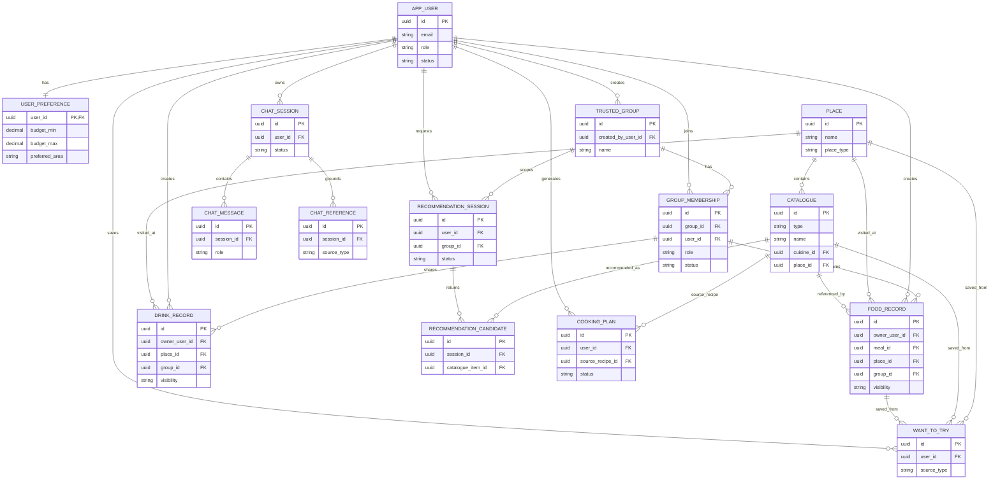

# FoodMind Backend High-Level ERD

Generated from the provided PostgreSQL schema dump. This is a simplified standard ERD that keeps only key business tables and main relationships.

## Table Grouping

- `CATALOGUE` represents the key catalogue tables: `meal`, `food_product`, `recipe`, and related place offerings.
- Supporting tables are hidden to keep the ERD readable: auth sessions, media assets, invitations, taxonomy joins, recipe details, cooking details, chat citations, feedback details, audit/idempotency, and Flyway metadata.
