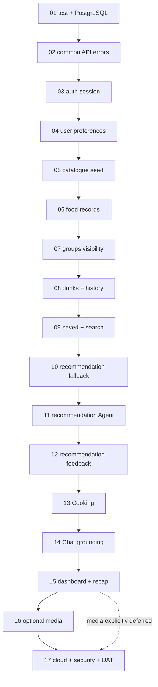

# FoodMind Backend Feature-Branch Delivery Roadmap

**Status:** Proposed implementation playbook

**Owner:** Chen Yaqi

**Last updated:** 28 July 2026

**Scope:** Documentation, PostgreSQL/Flyway scripts, PR hand-off documents, and
Postman artifacts for implementing the complete frozen-MVP backend. Java/Spring
implementation is performed by the repository owner.

## 1. How to use this roadmap

Implement the branches below in order. Unless a branch plan explicitly says
otherwise:

1. Wait until the preceding branch is merged to `master`.
2. Pull the protected `master`.
3. Create the exact branch name listed in the matrix.
4. Follow that branch's document in `docs/planning/branches/`.
5. Make only the commits listed in its commit plan.
6. Run every required verification command.
7. Run the matching folder in the FoodMind Postman collection.
8. Copy the PR body from the branch document, replace evidence placeholders,
   and open the Pull Request.
9. Squash-merge only after CI, review, and Postman/UAT evidence pass.

Do not implement later branches early merely because their database tables
already exist in the supplied SQL scripts. The migrations are a coordinated
schema deliverable; application code still follows vertical-slice order.

## 2. Branch and artifact matrix

| Order | Branch | Primary BE items | Schema dependency / action | Postman folder | Branch plan |
| ---: | --- | --- | --- | --- | --- |
| 01 | `chore/backend-test-postgres` | BE-001–BE-004, BE-009 | commit and validate the complete V1–V11 foundation | `00 - Platform Health` | [plan](branches/01-backend-test-postgres.md) |
| 02 | `feat/common-api-errors` | BE-005, error-contract part of BE-008 | none | `01 - API Conventions` | [plan](branches/02-common-api-errors.md) |
| 03 | `feat/auth-session` | BE-006, auth/current-user part of BE-008 | use V2 identity/auth objects | `02 - Authentication` | [plan](branches/03-auth-session.md) |
| 04 | `feat/user-preferences` | BE-007, preference part of BE-008 | use V3 preference objects | `03 - User and Preferences` | [plan](branches/04-user-preferences.md) |
| 05 | `feat/catalogue-seed` | BE-010 | use V4 catalogue and V11 deterministic seed | `04 - Catalogue` | [plan](branches/05-catalogue-seed.md) |
| 06 | `feat/food-records` | BE-011 | use V5 food/media and V6 search-vector objects | `05 - Food Records` | [plan](branches/06-food-records.md) |
| 07 | `feat/groups-visibility` | BE-013–BE-015 | use V5 groups and V7 share objects | `06 - Groups and Visibility` | [plan](branches/07-groups-visibility.md) |
| 08 | `feat/drink-records-history` | BE-012 and combined history | use V5 drink objects | `07 - Drink Records and History` | [plan](branches/08-drink-records-history.md) |
| 09 | `feat/want-to-try-search` | BE-016–BE-017 | use V6 saved/search objects | `08 - Saved, Search and Explore` | [plan](branches/09-want-to-try-search.md) |
| 10 | `feat/recommendation-fallback` | BE-018–BE-021 | use V7 recommendation and V10 idempotency objects | `09 - Recommendation Fallback` | [plan](branches/10-recommendation-fallback.md) |
| 11 | `feat/recommendation-agent` | BE-022–BE-024 | use V7 model/evidence columns | `10 - Recommendation Agent` | [plan](branches/11-recommendation-agent.md) |
| 12 | `feat/recommendation-feedback` | BE-025–BE-025A | use V7 feedback and V10 ML export view | `11 - Recommendation Feedback` | [plan](branches/12-recommendation-feedback.md) |
| 13 | `feat/cooking-plan` | BE-026 | use V8 cooking and V10 idempotency objects | `12 - Cooking Plans` | [plan](branches/13-cooking-plan.md) |
| 14 | `feat/chat-grounding` | BE-027–BE-028 | use V9 chat objects | `13 - Chat and Grounding` | [plan](branches/14-chat-grounding.md) |
| 15 | `feat/dashboard-recap` | BE-029 | use V10 analytics views | `14 - Dashboard and Recap` | [plan](branches/15-dashboard-recap.md) |
| 16 | `feat/media-upload` | BE-030 | use V5 media metadata | `15 - Media Upload` | [plan](branches/16-media-upload.md) |
| 17 | `chore/cloud-security-uat` | BE-031–BE-040 | verify V1–V11; add V12+ only for measured forward fixes | `16 - Security and UAT` | [plan](branches/17-cloud-security-uat.md) |

The consolidated SQL files are intentionally supplied and committed together
in Branch 01 so the complete schema can be reviewed, migrated from empty, and
treated as an immutable implementation contract before Java work starts.
Branches 03–17 consume those objects; their plans must not recommit or edit
V1–V11. If implementation reveals a schema correction, create the next
numbered forward migration (for example
`V12__correct_chat_reference_constraint.sql`) in the branch that first needs
the correction and record the reason, upgrade proof, and rollback impact in its
PR.

## 3. Branch dependency graph



This order favours a single safe vertical slice over parallel disconnected
controllers. If team capacity requires parallel work, only branch from a shared
contract commit and rebase after the dependency branch merges. Never duplicate
entities, error shapes, or permission policies to avoid waiting.

## 4. Standard source layout used by every feature plan

```text
src/main/java/com/foodmind/foodmindbackend/<feature>/
├── api/
│   ├── <Feature>Controller.java
│   ├── request/
│   └── response/
├── application/
│   ├── <UseCase>.java
│   └── port/
├── domain/
│   ├── model/
│   ├── policy/
│   └── exception/
└── infrastructure/
    ├── persistence/
    │   ├── entity/
    │   ├── repository/
    │   └── mapper/
    └── integration/
```

Create only the folders required by the branch. Do not add empty architecture
ceremony. Controllers call application use cases, application code calls ports,
and infrastructure implements ports. Controllers never call JPA repositories.

## 5. Standard commit policy

Each commit must:

- build independently;
- contain one reviewable concern;
- include its tests;
- include the matching contract change in the same commit when public behaviour
  changes;
- include the matching Flyway migration in the first commit that needs it; and
- not mix formatting or unrelated refactoring.

Allowed Conventional Commit scopes:

```text
chore(build)
chore(ci)
chore(container)
chore(db)
chore(deploy)
chore(media)
chore(release)
feat(api)
feat(auth)
feat(user)
feat(preference)
feat(catalog)
feat(record)
feat(group)
feat(search)
feat(recommendation)
feat(cooking)
feat(chat)
feat(analytics)
feat(media)
feat(observability)
feat(operations)
perf(db)
test(api)
test(analytics)
test(architecture)
test(auth)
test(catalog)
test(cooking)
test(db)
test(media)
test(preference)
test(recommendation)
test(record)
test(security)
test(uat)
docs(api)
docs(architecture)
docs(operations)
```

The per-branch plans provide exact messages. If an implementation needs an
additional commit, use the same scope and explain why in the PR.

## 6. Standard PR evidence

Every PR body must contain:

- linked BE items and use cases;
- scope and explicit non-scope;
- architecture/data-flow summary;
- migrations and rollback/forward-fix note;
- public/internal contract changes;
- permission rules;
- test commands and results;
- Postman folder and run result;
- screenshots or response excerpts with tokens and personal data removed;
- configuration names added, without values;
- risks, follow-up issues, and cross-repository actions; and
- author checklist.

Use the ready-to-copy PR section in the relevant branch document. A plan or
unchecked box is not completion evidence.

## 7. Standard Postman execution contract

The collection is designed for direct import:

```text
postman/
├── FoodMind-Backend.postman_collection.json
├── FoodMind-Local.postman_environment.json
└── FoodMind-Staging.postman_environment.json
```

Execution order:

1. Import the collection and one environment.
2. Set only environment-specific non-secret values.
3. Run folders `00` through `14` in numeric order, run optional media folder
   `15` only when Branch 16 is delivered, then run folder `16`; record an
   approved media deferral as `N/A`, not as a passing execution.
4. Authentication requests capture access/session variables.
5. Creation requests capture resource IDs.
6. Negative requests use the secondary user/session variables.
7. Collection scripts generate correlation and idempotency keys.
8. Export the Postman run report or retain CLI output as PR evidence.

Never commit real access tokens, refresh tokens, passwords, service tokens, or
production URLs.

## 8. Full-backend completion gate

The backend documentation package is complete only when:

- all 17 branch plan files exist and contain implementation, commits, PR body,
  and Postman mapping;
- V1–V11 SQL scripts parse and migrate an empty PostgreSQL database in order;
- all tables, constraints, indexes, views, and seeds from the architecture plan
  are represented or explicitly deferred;
- the Postman collection and environments parse as valid JSON and cover every
  planned public endpoint plus required negative permission/fallback cases;
- all local links resolve;
- the branch-to-BE-item and branch-to-Postman matrices have no gaps; and
- unresolved Admin, reusable pantry, and group-poll scope is not silently
  implemented.
